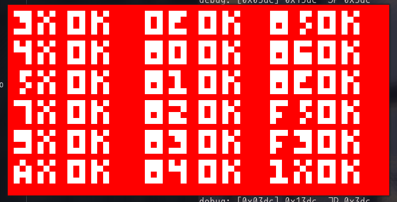

# my chip8 emulator

I started making this like 2 weeks ago, it was a good first introduction to using graphics with C and I enjoyed learning more about the CHIP-8 emulator

update: 5/10/25 TEST ROM PASSES!!!



## usage 

the executable binary is already included, you can run 

```bash
./chip8 hbd.ch8
```
to execute the ROM

you can replace hbd.ch8 with a rom of your choice

## development

make sure you have SDL2 installed

on arch linux you can install with 

```bash
sudo pacman -S sdl2
```

then compile with 
```bash
gcc -ggdb main.c -lSDL2 -lSDL2main -o chip8 -Wall
```
or just 

```bash
make
```
